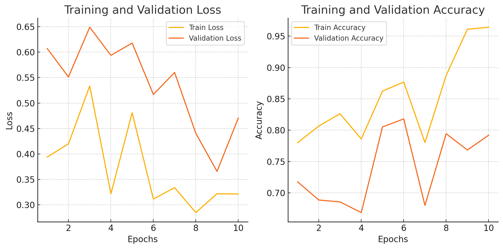

# MLTrainer

A lightweight, flexible PyTorch training framework designed to streamline model training, evaluation, and logging. 

## Features

- **Training and Validation**: Supports easy training and evaluation loops
- **Mixed Precision Training**: Leverages PyTorch's AMP for memory-efficient training on compatible GPUs.
- **Checkpointing**: Save and load model checkpoints to resume training. 
- **Early Stopping**: Automatically stop training when validation loss stagnates.
- **Logging**: Custom logger for comprehensive training logs
- **Callbacks**: Support for custom callbacks to extend functionality.
- **Visualization**: Plot training history with `matplotlib`.

## Installation

First, clone this repository, then install the required libraries:

```bash
git clone https://github.com/baseprime/MLTrainer.git
cd MLTrainer 
pip install -r requirements.txt
```

## Usage
```python
import torch
from torch.optim import Adam
from torch.nn import CrossEntropyLoss
from model import MyModel  # Your model definition here
from data_loader import train_loader, val_loader  # Your data loaders here

# Model, optimizer, and loss function
model = MyModel()
optimizer = Adam(model.parameters(), lr=0.001)
loss_fn = CrossEntropyLoss()

# Initialize the trainer 
trainer = MLTrainer(model, optimizer, loss_fn, device='cuda', mixed_precision=True)

# Start training
trainer.train(train_loader, val_loader=val_loader, epochs=10, log_interval=10, early_stopping_patience=3)
```

## Example Plots

MLTrainer allows you to plot training and validation metrics to monitor progress over epochs.




## License

[MIT License](http://opensource.org/licenses/MIT)
